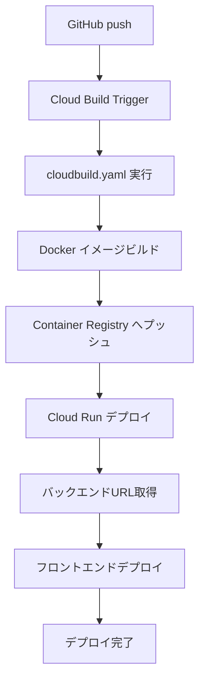

# Cloud Build のみを使用したGitHub連携デプロイガイド

## 🎯 概要
Cloud BuildとGitHubを連携させ、コードをプッシュするだけで自動的にCloud Runへデプロイする設定方法です。

---

## 📋 前提条件
- Google Cloudアカウント
- GitHubアカウント  
- プロジェクト作成済み
- 課金有効化済み
- NanoBanana API Key取得済み

---

## 🔧 手順1: Google Cloud の初期設定

### 1.1 必要なAPIを有効化

[Google Cloud Console](https://console.cloud.google.com) にアクセスして、以下のAPIを有効化:

1. 左メニュー → 「APIとサービス」→「ライブラリ」
2. 以下を検索して「有効にする」:
   - ✅ **Cloud Build API**
   - ✅ **Cloud Run Admin API**
   - ✅ **Container Registry API**
   - ✅ **Secret Manager API**（推奨）

### 1.2 Cloud Buildサービスアカウントに権限を付与

1. 左メニュー → 「IAMと管理」→「IAM」
2. `[PROJECT_NUMBER]@cloudbuild.gserviceaccount.com` を探す
3. 鉛筆アイコン（編集）をクリック
4. 以下のロールを追加:
   - **Cloud Run 管理者**
   - **サービス アカウント ユーザー**
   - **Container Registry サービス エージェント**

---

## 🔐 手順2: Secret Manager でAPIキーを管理（推奨）

### 2.1 シークレットの作成

1. 左メニュー → 「Secret Manager」
2. 「シークレットを作成」をクリック
3. 以下を入力:
   - **名前**: `nanobanana-api-key`
   - **シークレット値**: あなたのNanoBanana APIキー
4. 「シークレットを作成」

### 2.2 Cloud Buildにアクセス権限を付与

1. 作成したシークレットをクリック
2. 「権限」タブ → 「アクセス権を付与」
3. 新しいプリンシパル: `[PROJECT_NUMBER]@cloudbuild.gserviceaccount.com`
4. ロール: **Secret Manager のシークレット アクセサー**
5. 「保存」

---

## 🔗 手順3: GitHubリポジトリとCloud Buildを連携

### 3.1 Cloud Build トリガーの作成

1. [Cloud Console](https://console.cloud.google.com) → 「Cloud Build」→「トリガー」
2. 「トリガーを作成」をクリック

### 3.2 ソースの設定

1. **名前**: `deploy-standing-set` （任意）
2. **イベント**: 「ブランチへのpush」を選択
3. **ソース**:
   - 「リポジトリ」で「新しいリポジトリを接続」をクリック
   - **ソースプロバイダ**: GitHub（Cloud Build GitHub アプリ）
   - 「続行」→ GitHubで認証
   - リポジトリを選択して「接続」

### 3.3 構成の設定

1. **含まれるファイルフィルタ（glob）**: 空欄のまま（すべてのファイル）
2. **ブランチ**: `^main$` または `^master$`
3. **構成**:
   - タイプ: 「Cloud Build 構成ファイル（yaml または json）」
   - 場所: `/cloudbuild.yaml`

### 3.4 詳細設定（重要）

「詳細設定を表示」をクリック:

#### 置換変数の追加
「置換変数を追加」をクリックして以下を設定:

| 変数名 | 値 |
|--------|-----|
| `_REGION` | `asia-northeast1` |
| `_NANOBANANA_API_KEY` | `${SECRET:nanobanana-api-key}` ※Secret Manager使用時 |

※Secret Managerを使わない場合は、APIキーを直接入力（非推奨）

#### サービスアカウント
- デフォルトのままでOK

### 3.5 作成

「作成」ボタンをクリック

---

## ✅ 手順4: デプロイのテスト

### 4.1 手動実行でテスト

1. Cloud Build → トリガー
2. 作成したトリガーの「実行」ボタンをクリック
3. ブランチ: `main` を選択
4. 「トリガーを実行」

### 4.2 ビルド状況の確認

1. Cloud Build → 履歴
2. 実行中のビルドをクリック
3. ログでビルド進捗を確認

### 4.3 自動デプロイのテスト

```bash
# コードを変更
git add .
git commit -m "Test Cloud Build deployment"
git push origin main
```

プッシュ後、自動的にビルドが開始されます。

---

## 📊 手順5: デプロイの確認

### 5.1 Cloud Buildの確認

1. Cloud Build → 履歴
2. ビルドが成功（緑のチェック ✅）していることを確認

### 5.2 Cloud Runの確認

1. Cloud Run → サービス
2. 以下のサービスが表示されることを確認:
   - `standing-set-backend`
   - `standing-set-frontend`

### 5.3 アプリケーションへのアクセス

1. `standing-set-frontend` サービスをクリック
2. 上部のURLをクリック
3. アプリケーションが正常に表示されることを確認

---

## 🐛 トラブルシューティング

### エラー: Permission denied

```
ERROR: (gcloud.run.deploy) PERMISSION_DENIED: Permission 'run.services.create' denied
```

**解決方法**: 
1. IAM → Cloud Buildサービスアカウントに「Cloud Run 管理者」ロールを追加

### エラー: Secret not found

```
ERROR: failed to access secret version
```

**解決方法**:
1. Secret Managerでシークレットが作成されているか確認
2. Cloud Buildサービスアカウントにアクセス権限があるか確認

### エラー: Build failed

ビルドログを確認:
1. Cloud Build → 履歴 → 失敗したビルド
2. エラーメッセージを確認
3. よくある原因:
   - `cloudbuild.yaml` の構文エラー
   - Dockerfileのパスが間違っている
   - npmパッケージのインストールエラー

### エラー: Frontend cannot connect to backend

```
Failed to fetch
```

**解決方法**:
1. Cloud Run → `standing-set-frontend` → 新しいリビジョンの編集とデプロイ
2. 環境変数 `VITE_API_URL` がバックエンドのURLになっているか確認

---

## 🔄 デプロイフロー



---

## 💡 ベストプラクティス

### 1. ブランチ戦略
- `main`: 本番環境
- `develop`: 開発環境用トリガーを別途作成
- `feature/*`: プルリクエストでレビュー

### 2. 環境ごとのトリガー
開発環境用に別のトリガーを作成:
- ブランチ: `^develop$`
- 置換変数で異なるサービス名を指定

### 3. ビルド通知
1. Cloud Build → 設定
2. 「通知」でSlackやメール通知を設定

### 4. コスト最適化
- Cloud Buildの無料枠: 120分/日
- 不要なトリガーは無効化
- ビルドキャッシュを活用

---

## 📝 cloudbuild.yaml の主要部分

```yaml
# ビルドステップ
steps:
  # 1. Dockerイメージのビルド
  # 2. Container Registryへプッシュ  
  # 3. Cloud Runへデプロイ
  # 4. 環境変数の設定

# 置換変数（トリガーで設定）
substitutions:
  _REGION: 'asia-northeast1'
  _NANOBANANA_API_KEY: '${SECRET:nanobanana-api-key}'
```

---

## 🔒 セキュリティ推奨事項

1. **Secret Manager を必ず使用**
   - APIキーを直接yamlに書かない
   - トリガーの置換変数にも直接書かない

2. **最小権限の原則**
   - Cloud Buildサービスアカウントには必要最小限の権限のみ付与

3. **監査ログの確認**
   - Cloud Logging でビルドログを定期的に確認

---

## 📚 参考リンク

- [Cloud Build ドキュメント](https://cloud.google.com/build/docs)
- [Cloud Run ドキュメント](https://cloud.google.com/run/docs)
- [Secret Manager ドキュメント](https://cloud.google.com/secret-manager/docs)