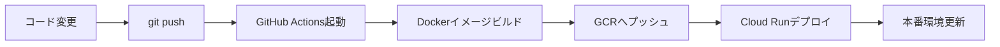

# GitHub連携でのCloud Run自動デプロイ設定ガイド

## 🎯 概要
GitHubにプッシュすると自動的にCloud Runへデプロイされる設定方法です。

## 📋 前提条件
- GitHubアカウント
- Google Cloudアカウント
- プロジェクト作成済み
- 課金有効化済み
- NanoBanana API Key取得済み

---

## 🔧 手順1: Google Cloud側の準備

### 1.1 プロジェクトIDの確認
1. [Google Cloud Console](https://console.cloud.google.com) にアクセス
2. 上部のプロジェクト名をクリック
3. プロジェクトIDをメモ（例: `my-project-123456`）

### 1.2 必要なAPIを有効化
左メニュー → 「APIとサービス」→「ライブラリ」で以下を有効化:
- ✅ Cloud Run API
- ✅ Cloud Build API  
- ✅ Container Registry API
- ✅ IAM Service Account Credentials API

### 1.3 サービスアカウントの作成
1. 左メニュー → 「IAMと管理」→「サービスアカウント」
2. 「サービスアカウントを作成」をクリック
3. 以下を入力:
   - **サービスアカウント名**: `github-deploy`
   - **サービスアカウントID**: 自動生成されたものでOK
   - **説明**: GitHub Actions用デプロイアカウント
4. 「作成して続行」をクリック

### 1.4 権限の付与
以下のロールを追加:
- **Cloud Run 管理者**
- **Cloud Build サービス アカウント**
- **Container Registry サービス エージェント**
- **サービス アカウント ユーザー**

「続行」→「完了」をクリック

### 1.5 サービスアカウントキーの作成
1. 作成したサービスアカウント（`github-deploy`）をクリック
2. 「キー」タブを選択
3. 「鍵を追加」→「新しい鍵を作成」
4. **JSON形式**を選択して「作成」
5. ダウンロードされたJSONファイルを安全に保管

---

## 🔐 手順2: GitHub側の設定

### 2.1 リポジトリの作成（新規の場合）
1. GitHubで新しいリポジトリを作成
2. ローカルのコードをプッシュ:
```bash
cd /Users/dcenter/Desktop/立ち絵生成
git init
git add .
git commit -m "Initial commit"
git branch -M main
git remote add origin https://github.com/YOUR_USERNAME/YOUR_REPO.git
git push -u origin main
```

### 2.2 GitHub Secretsの設定
1. GitHubのリポジトリページを開く
2. 「Settings」タブをクリック
3. 左メニュー → 「Secrets and variables」→「Actions」
4. 「New repository secret」をクリックして以下を追加:

#### Secret 1: GCP_PROJECT_ID
- **Name**: `GCP_PROJECT_ID`
- **Secret**: あなたのプロジェクトID（例: `my-project-123456`）

#### Secret 2: GCP_SA_KEY
- **Name**: `GCP_SA_KEY`
- **Secret**: ダウンロードしたJSONファイルの**全内容をコピーして貼り付け**

#### Secret 3: NANOBANANA_API_KEY
- **Name**: `NANOBANANA_API_KEY`
- **Secret**: NanoBananaのAPIキー

---

## 🚀 手順3: Cloud Buildトリガーの設定（オプション）

GitHub ActionsとCloud Buildの両方を使う場合:

### 3.1 Cloud Buildトリガーの作成
1. [Cloud Console](https://console.cloud.google.com) → 「Cloud Build」→「トリガー」
2. 「トリガーを作成」をクリック

### 3.2 ソースの設定
1. **イベント**: プッシュされた時
2. **ソース**:
   - リポジトリ: 「新しいリポジトリを接続」
   - **GitHub（Cloud Build GitHub アプリ）**を選択
   - GitHubで認証
   - リポジトリを選択
   - 「接続」をクリック

### 3.3 構成の設定
1. **ブランチ**: `^main$`（またはmaster）
2. **構成**:
   - タイプ: Cloud Build構成ファイル
   - 場所: `/cloudbuild.yaml`

### 3.4 詳細設定
1. **サービスアカウント**: デフォルトでOK
2. 「作成」をクリック

---

## ✅ 手順4: デプロイのテスト

### 4.1 GitHub Actionsでのデプロイ
1. コードを変更してコミット:
```bash
git add .
git commit -m "Test deployment"
git push origin main
```

2. GitHubリポジトリ → 「Actions」タブで進行状況を確認

### 4.2 手動デプロイ（テスト用）
1. GitHub → 「Actions」タブ
2. 「Deploy to Cloud Run」ワークフロー
3. 「Run workflow」→「Run workflow」をクリック

---

## 📊 手順5: デプロイの確認

### 5.1 GitHub Actions の確認
1. 「Actions」タブでワークフローの実行状況を確認
2. 緑のチェックマーク ✅ が表示されたら成功

### 5.2 Cloud Run の確認
1. [Cloud Console](https://console.cloud.google.com) → 「Cloud Run」
2. サービス一覧に以下が表示されているか確認:
   - `standing-set-backend`
   - `standing-set-frontend`

### 5.3 アプリケーションへのアクセス
1. `standing-set-frontend` サービスをクリック
2. 上部のURLをクリックしてアプリケーションにアクセス

---

## 🐛 トラブルシューティング

### エラー: Permission denied
```
Error: Permission 'run.services.create' denied
```
**解決方法**: サービスアカウントに「Cloud Run 管理者」ロールを追加

### エラー: API not enabled
```
Error: Cloud Run API has not been enabled
```
**解決方法**: Cloud Run APIを有効化

### エラー: Invalid JSON key
```
Error: Could not parse credentials
```
**解決方法**: `GCP_SA_KEY`にJSONファイルの内容全体をコピーしているか確認

### エラー: Build failed
GitHub Actionsのログで詳細を確認:
1. Actions タブ → 失敗したワークフロー
2. エラーメッセージを確認
3. よくある原因:
   - Dockerfileのパスが間違っている
   - package.jsonが見つからない
   - ビルドエラー

---

## 🔄 継続的デプロイの流れ



1. **開発者がコードを変更してプッシュ**
2. **GitHub Actionsが自動起動**
3. **Dockerイメージをビルド**
4. **Google Container Registryにプッシュ**
5. **Cloud Runに自動デプロイ**
6. **数分で本番環境に反映**

---

## 💡 ベストプラクティス

### ブランチ戦略
- `main` ブランチ: 本番環境
- `develop` ブランチ: 開発環境
- feature ブランチで開発 → PR → マージ

### 環境変数の管理
- 機密情報は必ずGitHub Secretsに保存
- `.env`ファイルはコミットしない
- Secret Managerの使用も検討

### モニタリング
- Cloud Run → メトリクスでパフォーマンス監視
- Cloud Logging でエラーログ確認
- アラート設定で異常を早期発見

---

## 📝 参考リンク

- [GitHub Actions ドキュメント](https://docs.github.com/actions)
- [Cloud Run ドキュメント](https://cloud.google.com/run/docs)
- [Cloud Build ドキュメント](https://cloud.google.com/build/docs)